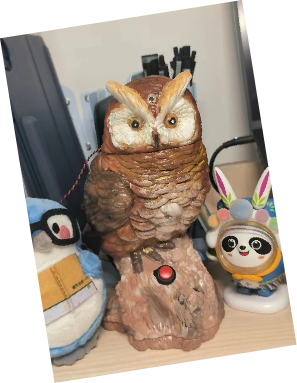
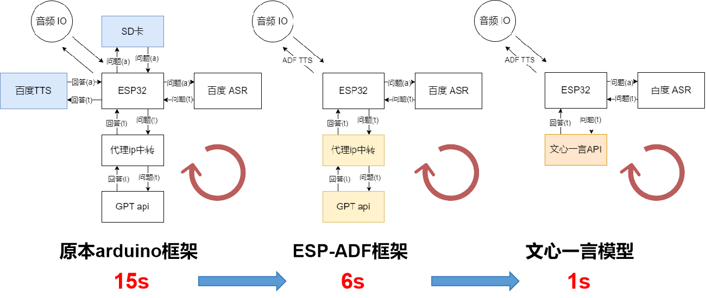
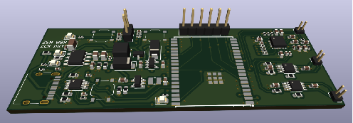
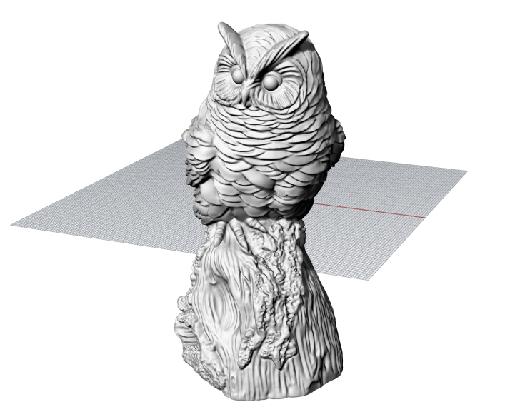

# AI-smart-assistant
BUAA  电子信息工程学院  第三届电子信息智能硬件创新大赛  校园网范围内的AI语音助手  帕主任的鹰

## 项目介绍

BUAA  第三届电子信息智能硬件创新大赛 参赛作品

基于ESP32-WROVER-E 8MB开发，实现了基于大语言模型的校园网范围内的AI语音助手，作品形象灵感来源于电视剧《萌学园》中的角色帕主任。

### submodule

* `esp_idf_project`: ESP32嵌入式软件项目，基于esp-idf开发框架
* 
* `kicad-project`: 项目PCB开发板

* `rhino-project`: 猫头鹰模型`.stl`文件

* `android-studio-project`: Android Studio开发的移动端APP

### contributor

* 张尚谋
* 王博冉
* 曾楚翔
* 韩若愚

## 功能介绍

